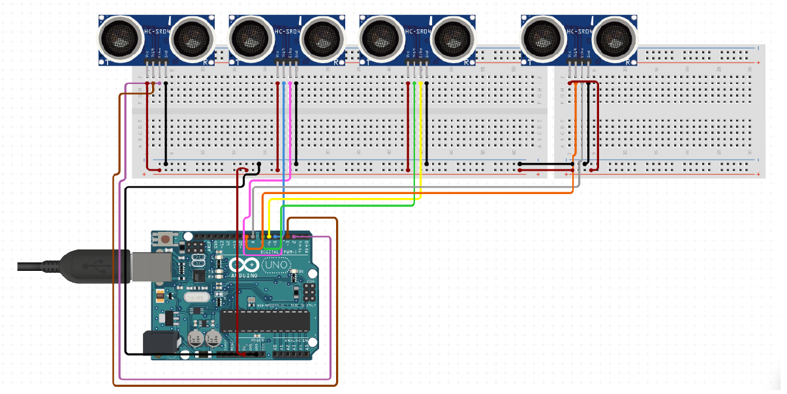
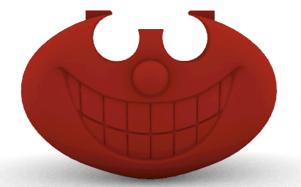
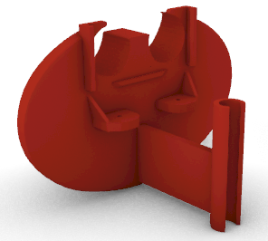

# Movement-Encouragement
## About
Final project in "Human-Computer Interaction" in The Hebrew University of Jerusalem.
The project was in collaboration with ALYN Hospital, the following hospital is a rehabilitation facility for pediatric and adolescent.

The goal of this project is to make movement exercises fun and entertaining for children.
It will be controlled by a Therapist and will set the session based on the child needs.
From working on legs movement to hand. All that can be controlled by the positioning of the sonars and the session that the therapist decides to use.
## Electric circuit
The circuit shows how the cable are connected to the arduino, in reality each sonar
is set inside a stand we printed while that stand is connected to a microphone stand for example (based
on what you want to connect you need to remake the module physical agent connection tube.

## Physical Agent
The Physical Agent we had in this project is a stand for the sonars. This physical agent was made thanks to a Rhino 6 program, which is used for 3D modeling.
The physical agent was made to fit the stand we were using for the project.
Based on the stand you can change the size of the tube.

## Virtual Agent
The virtual agent was made using Processing 4.
The main screens of the virtual agent are:

Main screen: Were you can play a random game, change sounds and go to sessions.

Choose sound screen: You change the system sounds to be one of the following: piano, guitar, drums, electrical piano. or press to choose randomly.

Session screen: You got two options here: 
* Library screen.
* Children screen.

Library screen:
You can add \ play \ delete sessions from the library.

Children screen:
You can add new patients(children) or click a patients name if he/she exists. 

Child screen: You can add sessions from library to the child, create new session and delete existing sessions for that child.

While playing a session the current ball will flash on the screen so the child will notice what he/she needs to do next.
When he gets closer to the sonar the ball on the screen will start making more particles to show that he/she in the right direction.
When the child is closer than the set threshold the ball will turn black, a sound will be played based on the chosen sounds and the ball that turned black.
If it was the last ball we will show a victory screen else move to the next ball.
we will move to the next ball.
## Extra info
In the ExtraFiles.rar you can find:
* Video showing the virtual agent at work.
* 3dm file of the Physical agent.
* stl file for printing the Physical agent.
